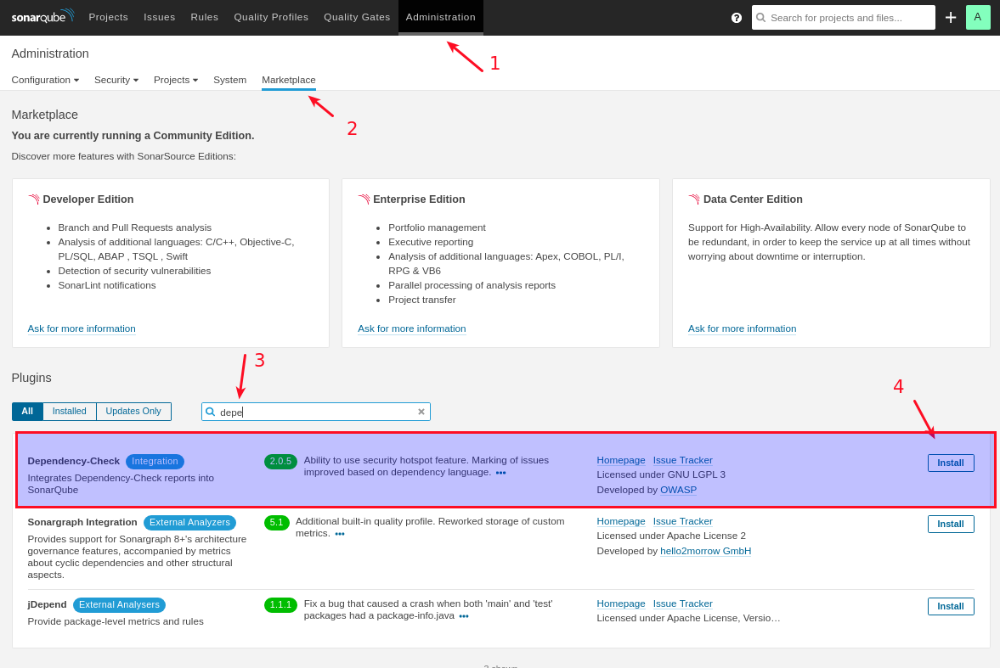
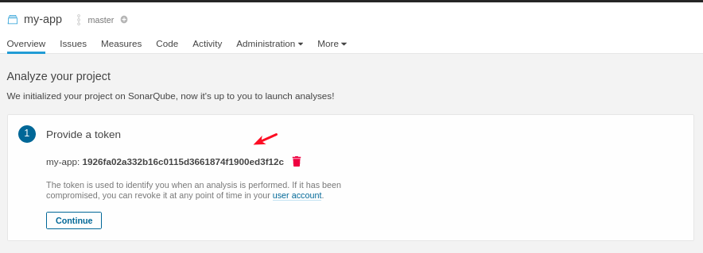
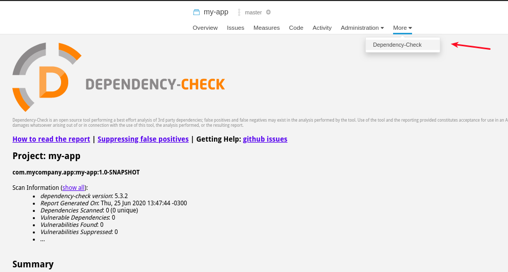
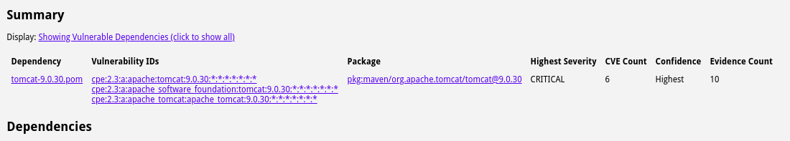
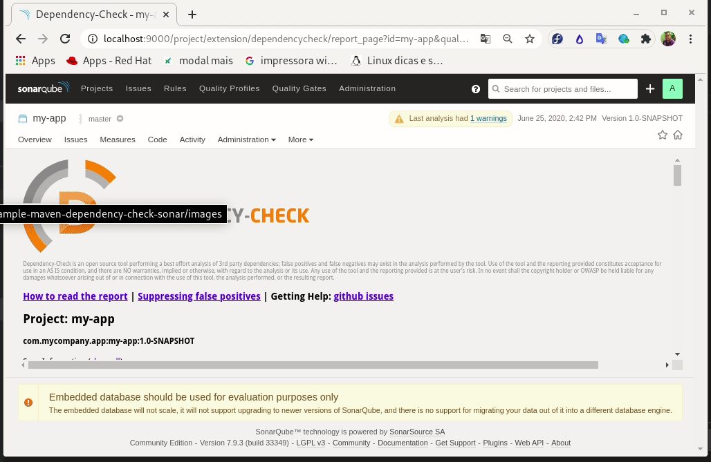

# Exemplo de uso do dependency check com sonar

Neste repositório temos um exemplo de um projeto maven que possui uma dependência vunerável, demonstramos o uso do plugin dependency check da OWASP sendo executado e o report gerado é enviado para o sonar, podendo impedir a continuidade do pipeline via script de verificação do quality gate do sonar. Também abordamos a supressão de falsos positivo.

## Montagem do laboratório 

### JVM e Maven
Para os testes do projeto foi feita a instalação da JVM via SDKMAN com o comando:

```bash
$ curl -s "https://get.sdkman.io" | bash
$ source "$HOME/.sdkman/bin/sdkman-init.sh"
$ sdk install java 8.0.252.j9-adpt
$ sdk install maven 3.6.3
$ mvn --version
Apache Maven 3.6.3 (cecedd343002696d0abb50b32b541b8a6ba2883f)
Maven home: /home/csantana/.sdkman/candidates/maven/current
Java version: 1.8.0_252, vendor: Eclipse OpenJ9, runtime: /home/csantana/.sdkman/candidates/java/8.0.252.j9-adpt/jre
Default locale: pt_BR, platform encoding: UTF-8
OS name: "linux", version: "5.6.14-300.fc32.x86_64", arch: "amd64", family: "unix"
$
```

Com a instalação do ambiente o projeto foi montado usando o comando:

```bash
$ mvn archetype:generate -DgroupId=com.mycompany.app -DartifactId=my-app -DarchetypeArtifactId=maven-archetype-quickstart -DarchetypeVersion=1.4 -DinteractiveMode=false
```
### Análise do Dependency check OWASP

A analise de vunerabilidade é obtida usando: 

```bash
$ mvn org.owasp:dependency-check-maven:check
```

No processo é feito o download da base de CVE reportado para as dependências.

### Sonar

O Sonar no exemplo utiliza uma imagem docker para facilitar o desenvolvimento do projeto, para baixar a imagem do projeto usamos o podman:

```bash
$ podman pull sonarqube:lts
```

A execução do sonar é feita usando o comando abaixo:

```bash
podman run --net=host -it sonarqube:lts
```
O sonarqube está disponível no endereço http://localhost:9000/ com o usuário admin e a senha admin.

Após a instalação é necessário instalar o plugin dependency check no maven. A instalação é feita na área administrativa do sonar conforme imagem abaixo:



Ao gerar um novo projeto para a aplicação no sonar, copie o token da aplicação:



Esse token "1926fa02a332b16c0115d3661874f1900ed3f12c" será utilizado para enviar a análise para o sonar via maven.

### Análise do dependency check no sonar

Agora para fazer a análise do dependency check e enviar o report para o sonar usamos o comando abaixo: 


```bash
$ mvn org.owasp:dependency-check-maven:check \
        sonar:sonar \
        -Dformat=ALL \
        -Dsonar.projectKey=my-app   \
        -Dsonar.host.url=http://localhost:9000/   \
        -Dsonar.login=1926fa02a332b16c0115d3661874f1900ed3f12c \
        -Dsonar.dependencyCheck.htmlReportPath=target/dependency-check-report.html \
        -Dsonar.dependencyCheck.jsonReportPath=target/dependency-check-report.json
```

Ao acessar a dashboard do sonar podemos ver que a aplicação executou a análise do sonar e enviou o report do dependency check para o servidor do sonar.



### Teste de vunerabilidade 

Para garantir o funcionamento do plugin e testar o report, vamos adicionar a dependência do tomcat que sabemos que está vunerável:

```xml
<dependency>
    <groupId>org.apache.tomcat</groupId>
    <artifactId>tomcat</artifactId>
    <version>9.0.30</version>
    <type>pom</type>
</dependency>
```

Ao executar novamente a análise, usando o comando maven, notamos que o report foi adicionado ao sonar.




### Verificando programaticamente o quality gate do sonar 

A análise do sonar pode ser verificada usando o script disponível *verify-sonar-quality-gate.sh*, este script é útil para a validação em pipeline:

```bash
$ ./verify-sonar-quality-gate.sh <TOKEN DO PROJETO>
```

```bash
$ ./verify-sonar-quality-gate.sh 1926fa02a332b16c0115d3661874f1900ed3f12c

verificando o quality gate do projeto...

O projeto NÃO ATENDEU ao quality gate. Para maiores detalhes acesse o dashboard do projeto em: http://localhost:9000/dashboard?id=my-app

FALHOU
```
NOTA: O script requer que o utilitário `jq` esteja disponível. 

Instale o utilitário usando o comando adequado ao seu sistema operacional.


### Tratando Falsos positivo

O verificador de dependência detecta o uso de vulnerabilidades conhecidas, procurando correspondências das dependências no projeto Maven com os componentes de software listados nas CVEs. Esse processo é um pouco superficial, porque eles têm esquemas diferentes para identificar o software. O Maven identifica dependências usando GroupId, ArtifactId and Version (GAV) e CVEs identificam software usando Common Platform Enumeration (CPE).

Esse processo então pode gerar falsos positivos. Portanto, independentemente do CPE, é sempre prudente ler a descrição do CVE e tirar nossas próprias conclusões.

Para impedir o reaparecimento de falsos positivos, podemos suprimir os erros reportados. Fazemos isso configurando um arquivo de supressão e informamos no pom.xml usando a opção suppressionFiles no pom.xml, Abaixo vemos o exemplo dessa configuração.

```xml
<build>
    <plugins>
      <plugin>
        <groupId>org.owasp</groupId>
        <artifactId>dependency-check-maven</artifactId>
        <configuration>
          <suppressionFiles>${basedir}/suppressed.xml</suppressionFiles>
        </configuration>
      </plugin>
    </plugins>
  </build>
```

O conteúdo do arquivo suppressed.xml deve ser o seguinte:
```xml
<?xml version="1.0" encoding="UTF-8"?>
<suppressions xmlns="https://jeremylong.github.io/DependencyCheck/dependency-suppression.1.3.xsd">

</suppressions>
```

Para informar a supressão de uma dependência devemos adicionar o conteúdo de supressão ao arquivo, o conteúdo para supressão é feito no report clicando no botão suppress conforme imagem abaixo e copiando o conteudo para dentro do arquivo:



Com isso o erro não é mais alertado nos reports do plugin do dependency check.